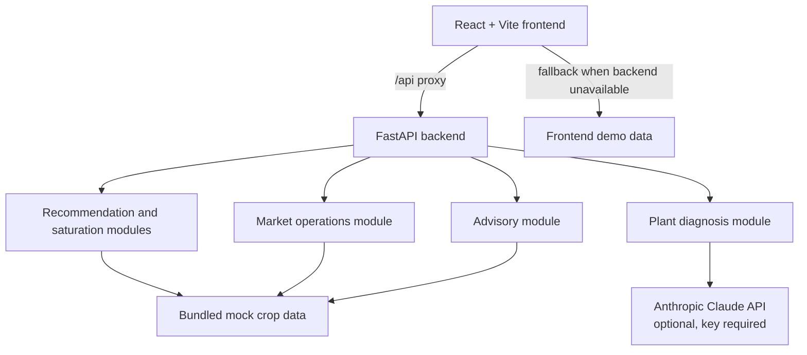

# FasalSetu

## Tagline

**Sahi Chunav, Behtar Bhav.**

## Project Overview

FasalSetu is an **AI-Powered End-to-End Crop Decision & Market Intelligence Platform** for farmers. It connects the decisions that are usually made in isolation: what to plant, how to manage the crop, how to understand market pressure, and where to sell.

The central idea is simple: **do not only predict the crop; understand the crowd around it.** FasalSetu uses crop price history and planted-area movement to surface oversupply risk before a farmer commits to a crop.

This repository contains a working prototype for Maharashtra districts and a bundled demonstration dataset. It is designed for a clear hackathon journey rather than a claim of live agricultural data coverage.

## Problem Statement

Farmers often make planting decisions from last season's attractive prices. When many farmers respond to the same signal, supply can rise sharply and prices can weaken by harvest time. The decision also does not end at planting: disease, weather conditions, harvest timing, transport cost, and mandi choice all affect the final outcome.

FasalSetu brings these decisions into one farmer-facing flow and explains its recommendations in plain language.

## Our Solution

FasalSetu guides a farmer through:

**PLAN → GROW → FORECAST → SELL**

- **Plan:** provide district, land size, season, soil, and irrigation inputs.
- **Grow:** receive crop planning and crop-specific weather or pest guidance.
- **Forecast:** compare expected crop profitability, saturation risk, and the prototype's market outlook.
- **Sell:** compare mandi prices after a transport-cost adjustment and identify the highest-net-price option.

## How FasalSetu Works

1. The farmer completes onboarding and selects a language.
2. The recommendation flow filters crops for the selected season.
3. Each crop is scored using expected profit and a Low, Medium, or High saturation-risk signal.
4. The farmer can compare crops, choose a plan, view a crop timeline, and read advisory alerts.
5. The farmer can inspect a crop image for plant-health diagnosis when the optional AI service is configured.
6. At harvest, mandi options are ranked by net price after transport cost, with a suggested selling window.

## Key Features

| Capability | Current implementation |
| --- | --- |
| Smart crop recommendation | Season-filtered crop list ranked using expected profit and saturation risk. |
| Crop saturation awareness | Compares the two most recent price and planted-area records; returns a risk label and explanation. |
| Crop disease detection | Image upload endpoint that sends a crop image to Anthropic Claude when `ANTHROPIC_API_KEY` is configured; the frontend also has a demonstration fallback. |
| Personalized crop advisory | Crop-specific weather and pest alerts, sourced from the bundled prototype data. |
| Market / price outlook | Bundled market outlook fields include harvest horizon, price range, and outlook label. These are prototype values, not live forecasts. |
| Best mandi / selling option | Compares mandi prices, subtracts transport cost using distance, and selects the highest net price. |
| Multilingual interface | Frontend translations and crop/season labels for English, Hindi, and Marathi. |

## Complete Farmer Journey


## System Architecture



The frontend runs on port `3000` and proxies `/api` requests to the FastAPI service on port `8000`. The backend loads crop, history, mandi, alert, and outlook values from the repository's bundled data. No government or live market integration is included in the current prototype.

## Tech Stack

| Layer | Technologies in this repository |
| --- | --- |
| Frontend | React 18, Vite, React Router, Tailwind CSS, Framer Motion, Axios, Recharts, Lucide React |
| Backend | FastAPI, Uvicorn, Pydantic, Python multipart uploads |
| AI integration | Anthropic Claude API for optional image-based plant diagnosis |
| Core logic | Plain Python modules with pytest coverage |
| Data | Bundled JSON prototype data plus frontend fallback/demo data |

## Project Structure

```text
frontend/     React application, routes, UI components, translations, and API client
backend/      FastAPI application, request validation, CORS, and service re-exports
ml/           Recommendation, saturation, market, advisory, and plant-diagnosis logic
Docs/         Product and project documentation
```

## Installation & Setup

### Prerequisites

- Node.js and npm
- Python 3
- An optional Anthropic API key for live image diagnosis through the backend

### Backend

From the repository root on Windows PowerShell:

```powershell
cd backend
python -m venv myenv
.\myenv\Scripts\python.exe -m pip install -r requirements.txt
cd ..
```

The repository already contains a `backend/myenv` environment in the supplied project state. Recreate it only when needed.

### Frontend

```powershell
cd frontend
npm install
```

### Optional plant diagnosis configuration

Set the key in the shell before starting the backend. The application returns a configuration error for diagnosis when the key is absent; the rest of the prototype can still use its bundled/fallback behavior.

```powershell
$env:ANTHROPIC_API_KEY = "your-key"
```

## Running the Application

Start the backend in one terminal:

```powershell
python -m uvicorn backend.main:app --host 0.0.0.0 --port 8000
```

Start the frontend in another terminal:

```powershell
cd frontend
npm run dev
```

Open `http://localhost:3000`. The backend API is available at `http://localhost:8000`.

### Backend API

| Method | Route | Purpose |
| --- | --- | --- |
| `GET` | `/` | API identity and available endpoint list |
| `GET` | `/health` | Service status, supported crops, and districts |
| `GET` | `/districts` | Supported district list |
| `GET` | `/recommend?district=&land_size=&season=` | Season-filtered, risk-aware crop recommendations |
| `GET` | `/market?crop=` | Mandi comparison, net prices, best mandi, and sell window |
| `GET` | `/advisory?crop=` | Crop-specific weather and pest alerts |
| `POST` | `/diagnose` | Multipart crop image diagnosis with `crop` and `image` fields |

## AI/ML Components

The repository's core recommendation modules are transparent, testable Python logic rather than trained models:

- **Saturation risk:** compares the latest two seasons. A strong price rise together with a strong planted-area rise is marked High risk; a strong price rise with low area growth is Low risk; other cases are Medium risk.
- **Crop recommendation:** filters by season and ranks expected profit after applying a risk weight, so a lower-risk crop can outrank a higher-profit but oversupply-prone crop.
- **Market operations:** computes `net_price = price - (distance_km × 5)` and sorts mandis by net price.
- **Advisory feed:** returns the crop's bundled weather and pest alerts.
- **Plant diagnosis:** sends an uploaded image and crop name to the configured Anthropic model and parses a structured health result. It includes graceful error handling when the service or key is unavailable.

There is no model-training pipeline, claimed accuracy benchmark, or live data ingestion pipeline in this repository.

## Data Flow

```text
Farmer inputs
	-> React state and API client
	-> FastAPI validation
	-> Python decision modules
	-> bundled crop/history/mandi/alert data
	-> enriched response
	-> localized farmer-facing cards and timelines
```

When the backend cannot be reached, the frontend API client uses local demonstration data for key screens. This makes the prototype easy to show during a hackathon while keeping the backend path available for local integration.

## Government Ecosystem Alignment

FasalSetu is conceptually aligned with India's digital agriculture direction: structured farmer and farm context, better crop decisions, soil-aware planning, transparent market discovery, and risk-aware support.

Potential future integration points include the **Digital Agriculture Mission**, **AgriStack**, **Soil Health Card**, **Agmarknet**, **e-NAM**, **PM-KISAN**, and **PMFBY**. These are alignment and future-integration contexts only. The current repository does **not** contain live APIs, authentication, or data integrations for these initiatives.

## Impact

FasalSetu aims to help farmers:

- see oversupply pressure before planting decisions become difficult to reverse;
- compare expected return with downside risk instead of chasing price alone;
- receive practical crop-specific guidance in a farmer-friendly interface;
- understand disease signals earlier through image diagnosis;
- choose a selling option using net price after transport cost.

The current prototype demonstrates the decision experience using bundled Maharashtra-focused sample data. Field impact and production performance would require validation with real users and trusted live data sources.

## Future Scope

- Connect verified live weather, price, mandi, and crop-area sources.
- Add authenticated farmer profiles and persistent farm history.
- Integrate government ecosystems where permitted and technically available.
- Expand regional, crop, language, and soil coverage.
- Add model evaluation, agronomist review, confidence calibration, and feedback loops for diagnosis and recommendations.
- Add notification channels for time-sensitive advisories and selling windows.

## USP

**FasalSetu is not just a disease detection or crop recommendation system. It connects the farmer's decision journey from crop planning to smarter selling.**

## Team

FasalSetu is presented as a hackathon prototype. Team member details are intentionally not hard-coded in the repository; add the participating names, roles, and contact links here for submission.

🌾 FasalSetu — Sahi Chunav, Behtar Bhav.
